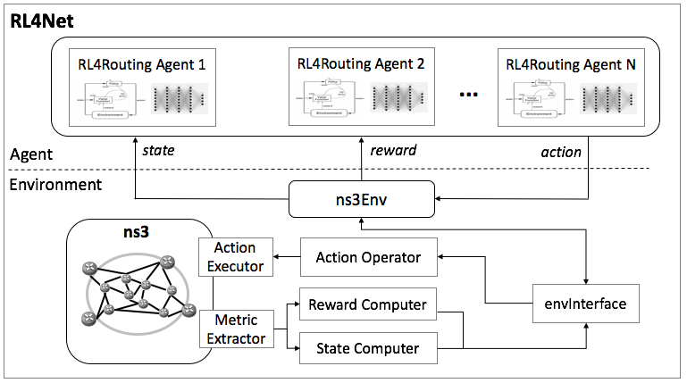

<!--
 * @author: Jiawei Wu
 * @create time: 2020-03-19 20:58
 * @edit time: 2020-04-20 21:16
 * @FilePath: /README.md
 -->
# RL4Net: A Packet-Level Network Simulator for Reinforcement Learning Based Cognitive Routing

## 1. Introduction

### 1.1 Motivation

The RL4Net simulator is developed based on the OpenAI Gym and ns-3, which specializes in facilitating the training of reinforcement learning based algorithms for cognitive routing problems.

### 1.2 Architecture

The general architecture of the RL4Net is illustrated below:

<p align="center">

</p>

RL4Net is composed of two functional blocks:  

- <b>Environment</b>: Environment is built on widely used ns3 network simulator [ns3](https://www.nsnam.org/). We extend ns3 with six components:   
    - <b>Metric Extractor</b> for computing quality metrics like delay and loss from ns3;   
    - <b>Computers</b> for translating quality metrics to DRL state and reward;  
    - <b>Action Operator</b> to get action commands from agent;  
    - <b>Action Executor</b> for perform ns3 operations by actions;   
    - <b>ns3Env</b> for transforming the ns3 object into DRL environment;   
    - <b>envInterface</b> to translate between ns3 data and DRL factors.     
- <b>Agent</b>: Agent is container of a DRL-based cognitive routing algorithm. A agent can built on various deep learning frameworks like pyTorch and Tensorflow.

### 1.3 Folders

- <b>./ns3-addon</b>: Files to be copied into ns3 source file folder for extension. It includes:
    - ns3-src/action-executor: code for Action Executor
    - ns3-src/metric-extractor: code for Metric Extractor
    - rapidjson: an open source JSON parser and generator
    - ns3-scratch: several examples of experiments on RL4Net
- <b>./ns3-env</b>: File for ns3Env block. It cinludes:
    - env-interface: code for envInterface
    - ns3-python-connector: code for connecting python and ns3 c++
- <b>./RL4Net-lib</b>: Libaray files developed by us
- <b>./TE-trainer</b>: Files for traning agents
- <b>./RLAgent</b>: Files of agents

## 2. Installation  

**Attention:** Switch to user root before installation is strongly recommended.  

### 2.1 Download RL4Net

First of all, you should download RL4Net from Github:  

```bash
git clone https://github.com/bupt-ipcr/RL4Net
```

by default, source code will be download into ./RL4Net folder.

### 2.2 Install dependent packages

To combine python and ns-3, RL4Net requires ZMQ and libprotoc. You can install as follow:  

```bash
# to install protobuf-3.6 on ubuntu 16.04:
sudo add-apt-repository ppa:maarten-fonville/protobuf
sudo apt-get update
apt-get install libzmq5 libzmq5-dev
apt-get install libprotobuf-dev
apt-get install protobuf-compiler
```

**Notice**: libprotoc version is 3.6 if you download this way.   The c++ file compiled will change 
at after version 3.7. Potential error will explain later.

### 2.3 Python requirements

Here we have requirements for python:

- To use RL4Net-lib, you need python>=3.6 for f-string.  

- To test the project, module `pytest` is required
  you can install `pytest` by:  

  ```bash
  pip install pytest -U
  ```

- (Optional) create conda enviornment
  You can use conda help you to manage above by:  

  ```bash
  conda create -n NAME python=VERSION
  ```

  which `NAME` means your environment name and valid `VERSION` for this project is `3.6` and `3.7`.  

- (Required) Install pytorch and cuda using appropriate instructions  
  You can checkout the install command in https://pytorch.org/  
  It will help you manage pytorch and cuda.  
  The recommended pytorch version is 1.4.0.

### 2.4 Install ns3  

Since RL4Net is based on ns-3, you need to install ns-3 before use RL4Net.  
The introcuction of ns-3 and how to install can be find at the [official website](https://www.nsnam.org/) of ns-3.  
As a recommendation, you can:  

1. Install dependencies  
   You can install ns-3 dependencies by following [official guide](https://www.nsnam.org/docs/release/3.30/tutorial/html/getting-started.html#prerequisites).  
2. Use git to install **ns-3-dev**  
   see: [downloading-ns-3-using-git](https://www.nsnam.org/docs/release/3.30/tutorial/html/getting-started.html#downloading-ns-3-using-git)  
   *you can also install a specific version od ns-3, such as ns-3.30, but we prefer ns-3-dev.*  

Another possible guide is wiki of ns-3, see: [wiki](https://www.nsnam.org/wiki/Installation#Installation) of installation

### 2.5 Install ns3 addon files

Now suppose you have successfuly installed ns-3-dev, you can start to install RL4Net.  

As recommendation, deactivate your conda env before run setup script.  
Conda may install libprotoc in your virtual environment with version >= 3.6, while your system libprotoc version is 3.6.  
Thus when configure, protoc head file will read version >= 3.6 and when build, protoc head file will read libprotoc v3.6 and cause error.

```bash
python ns3_setup.py --wafdir=YOUR_WAFPATH
```

the `YOUR_WAFPATH` is correspond to the introduction of ns-3 installation, where you can execute `./waf build`, typically `ns-3-allinone/ns-3-dev`. Remember to use absolute path.  

The default value of  wafdir is `/ns-3-dev` (notice it is subdir of '/'). As an alternative, you can copy the folder into `/ns-3-dev`, then run  

```bash
python ns3_setup.py
```

### 2.6 Install pyns3

pyns3 is the python module that connect python and ns3. Use pip(or pip3) to install this module with your python env(maybe conda).  

```bash
pip install ns3-env/ns3-python-connector
```

### 2.7 Install wjwgym

wjwgym is a lab that helps build reinforcement learning algorithms. See: [Github](https://github.com/LampV/Reinforcement-Learning)  
Install it with pip and your python env:  

```bash
pip install RL4Net-lib/wjwgym-home
```

The lab need numpy, torch and tensorboard. You can pre-install them, especially pytorch, by which you can choose pip/conda.

### 2.8 Validate installation and run an test

The test file can help you check if you have every in place. You can run test by:  

```bash
pytest
```

inside folder `RL4Net`, it will automatically detect test files.  
You can also specify file like:

```bash
pytest test_installation.py
```

# Contact

Jun Liu (liujun@bupt.edu.cn), Beijing University of Posts and Telecommunications, China
